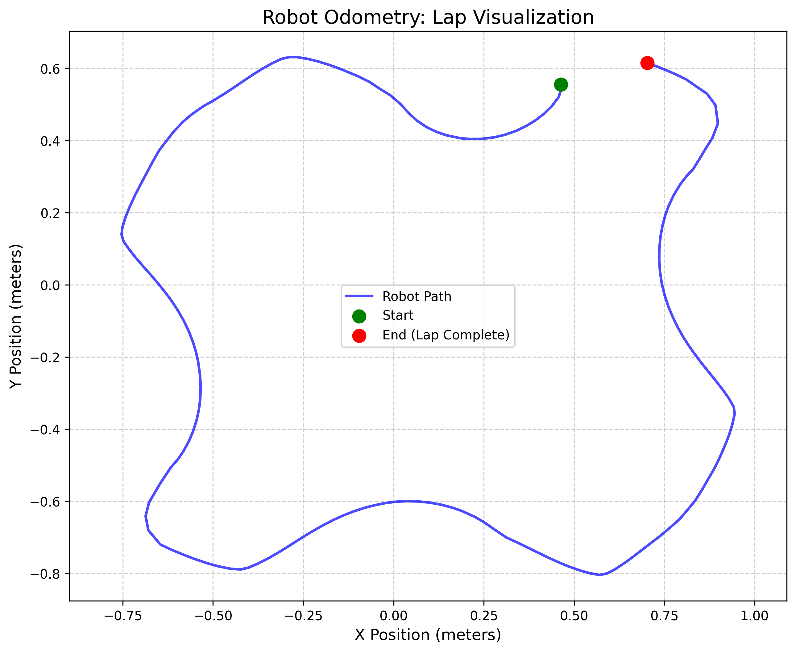
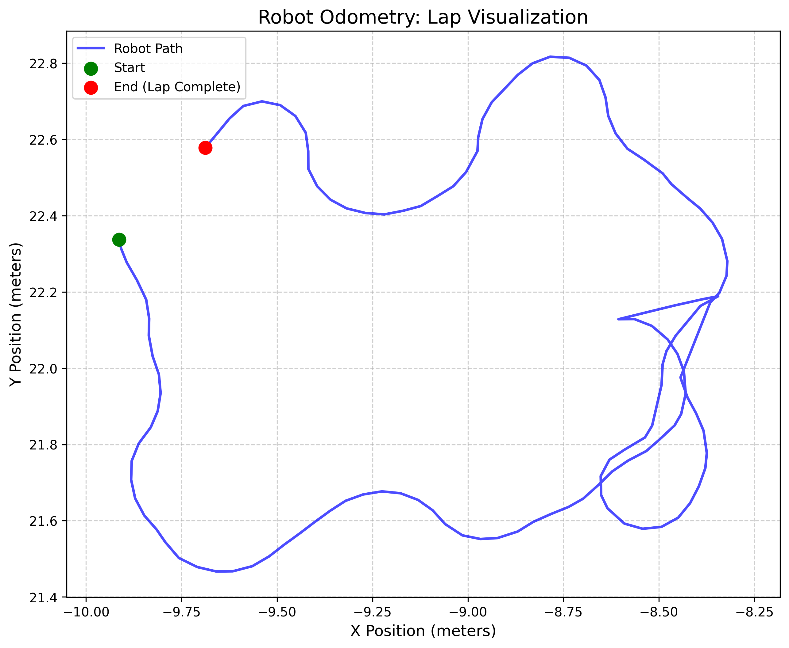

# 🤖 Wall Follower ROS2: Sim-to-Real Implementation

<div align="center">
  
  <p><i>Tested & Validated: Gazebo Simulation ➔ Physical Robot</i></p>

[](https://docs.ros.org/en/humble/index.html)
[](https://www.python.org/)
[](#)

</div>

---

## 📖 Overview

This repository contains a complete autonomous navigation system developed as the **Final Capstone Project** for the **ROS2 Certification** from [TheConstruct.AI](https://www.theconstruct.ai/).

The objective was to engineer a robust **Wall Following and Obstacle Avoidance** system. Instead of full SLAM navigation, this project focuses on reactive control—transforming raw Lidar data into smooth, intelligent movement to trace the contours of a complex track.

The system autonomously:

1.  **Locates the nearest wall** in an unknown environment.
2.  **Aligns itself** parallel to the obstacle.
3.  **Follows the wall** (PID Control) while maintaining a safe distance.
4.  **Avoids corners and obstacles** by filtering sensor noise in real-time.

---

## 🔄 From Simulation to Reality (Sim-to-Real)

A key learning outcome of this project was the **Sim-to-Real** workflow. Before deploying on physical hardware, the entire logic stack was developed, tested, and tuned in a high-fidelity **Gazebo** simulation.

### 1. Development in Gazebo

We first validated the logic in a noise-free environment. This allowed us to tune the PD controller gains ($K_p$, $K_d$) and test edge cases like cornering without risking hardware damage.

<div align="center">
  
  <p><i>Initial validation in Gazebo Simulation</i></p>
</div>

### 2. Deployment on Physical Robot

Once the logic was stable, we deployed it to the real robot. This introduced real-world challenges:

- **Sensor Noise**: Real Lidar data is messy and prone to "ghost" readings.
- **Physical Dynamics**: Friction, motor slippage, and inertia required re-tuning the PID controller.
- **Environment Gaps**: Real obstacles (like boxes) have physical gaps that confuse simple algorithms.

---

## 📈 The Journey: Evolution of Control

This project wasn't built in a day. The telemetry data below illustrates the evolution of our control logic, from chaotic oscillation to a perfect lap.

### Phase 1: The Struggle (Bang-Bang Control)

**Timestamp: 16:47:23**  
Initially, we used a simple "Bang-Bang" controller (if close, turn left; if far, turn right). This resulted in jagged movement and extreme oscillation. The robot survived but "wobbled" heavily.

<div align="center">
  
</div>

### Phase 2: The "Knot" (Early PD & Sensor Issues)

**Timestamp: 18:49:47**  
We implemented a Proportional Controller, but encountered a critical edge case. When passing a rectangular obstacle (the red box), the Lidar would see a sudden jump in distance. The robot interpreted this as "too far from wall" and aggressively turned _into_ the obstacle, getting stuck in a loop we called **"The Knot."**

<div align="center">
  
</div>

### Phase 3: Final Optimization (Robust PD + Gap Filtering)

**Timestamp: 21:55:01**  
The final solution involved:

1.  **Gap Jump Protection**: Ignoring sudden, large changes in wall distance (preventing the "Knot").
2.  **Derivative (D) Term**: Adding a D-term to the controller to dampen oscillations.
3.  **Ghost Filtering**: Filtering out Lidar values < 0.05m which caused "death spins."

**Result**: A perfect, smooth lap with zero collisions and high precision.

<div align="center">
  <table>
    <tr>
      <td align="center">
        
        <br><i>Real Robot Execution</i>
      </td>
      <td align="center">
        
        <br><i>Telemetry Data</i>
      </td>
    </tr>
  </table>
</div>

---

## 🏗️ Project Architecture

The codebase is modularized into two packages to separate interfaces from logic.

```
📦 ROS2-course-wall-follower-robot
 ┣ 📂 wall_follower_interfaces  # Custom Message Defintions
 ┃ ┣ 📂 srv
 ┃ ┃ ┗ 📜 FindWall.srv        # Request: void | Response: bool wallfound
 ┃ ┗ 📂 action
 ┃   ┗ 📜 OdomRecord.action   # Goal/Result: Distances | Feedback: Current Total
 ┃
 ┗ 📂 wall_follower             # Control Logic
   ┣ 📂 launch
   ┃ ┗ 📜 main.launch.py      # Master Launch File
   ┗ 📂 wall_follower
     ┣ 📜 wall_finder.py      # Service Server (Aligns robot to wall)
     ┣ 📜 wall_following.py   # Main PD Control Loop (The "Brain")
     ┗ 📜 odom_recorder.py    # Action Server (Telemetry & Path Tracking)
```

---

## 🧩 Code Logic & Structure

Here is a high-level breakdown of the decision-making process for the two main nodes.

### 1. Wall Finder Service (`wall_finder.py`)

**Goal**: "Handshake" with the environment. It resets the robot to a predictable valid state before the race starts.
**Structure**: Linear State Machine.

```python
# Pseudo-Code Logic
def callback(request):

    # PHASE 1: Scan & Rotate
    # Spin until the shortest ray in the 360 Lidar scan
    # is directly in front of the robot.
    rotate_to_min_distance()

    # PHASE 2: Approach
    # Drive forward towards the wall until close (45cm).
    while front_distance > 0.45:
        move_forward()

    # PHASE 3: Align Right
    # The robot is now facing the wall. We rotate 90 degrees
    # until the shortest ray is at index 540 (Right side).
    while not aligned_to_right:
        rotate_left()

    return "Wall Found - Ready to Race"
```

### 2. Wall Follower Controller (`wall_following.py`)

**Goal**: The main "Brain" that runs the lap. It is a reactive controller that runs 10 times per second.
**Structure**: Continuous PD Loop with Safety Overrides.

```python
# Pseudo-Code Logic
def laser_callback(scan):

    # 1. READ & CLEAN
    front = min(front_rays)
    right = min(right_rays)
    # Filter "Ghost" readings (dust/noise < 0.05m)
    if right < 0.05: right = last_valid_right

    # 2. "ANTI-KNOT" SAFETY GUARD
    # If the wall suddenly disappears (gap > 60cm) but front is clear:
    # It's not a corner, it's a hole! Ignore it.
    if right > (last_right + 0.6) and front > 0.5:
        right = setpoint (Pretend we allow see the wall)

    # 3. PD CALCULATION
    # How far off are we?
    error = setpoint - right
    # Calculate Turn: Proportional (React) + Derivative (Dampen)
    angular_z = (Kp * error) + (Kd * (error - prev_error))

    # 4. EXECUTE MOVEMENT
    if front < 0.20:
        EMERGENCY_REVERSE()
    elif front < 0.40:
        TURN_HARD_LEFT() # Corner Logic
    else:
        # Cruising Mode
        drive(speed=0.1, turn=angular_z)
```

---

## 🧠 Technical Deep Dive

### 1. Multithreading (The "Spin of Death" Fix)

In early versions, calling the `FindWall` service would block the main thread. This stopped the Lidar callback from updating, causing the robot to act on stale data and spin infinitely.

- **Solution**: We utilized `MultiThreadedExecutor` and `ReentrantCallbackGroup`. This allows the sensor callbacks (Lidar) to interrupt the service logic, ensuring the robot always perceives the latest state of the world.

### 2. The PD Controller

The navigation relies on a custom-tuned PD controller:

$$
LinearX = 0.1 \space m/s \quad (Constant) \\
AngularZ = (K_p \cdot error) + (K_d \cdot \frac{d(error)}{dt})
$$

- **Error**: `Desired_Distance (0.3m) - Current_Distance`
- **Kp (1.2)**: Controls reactivity.
- **Kd (6.0)**: Controls smoothness (damping).

### 3. "Anti-Knot" Gap Filter

To solve the "Knot" problem (Phase 2), we implemented a heuristic filter:

```python
if front_clear and (current_wall_dist > last_valid_dist + 0.6):
    # Sudden jump detected! (e.g., end of a box)
    # Ignore the jump and maintain previous course
    used_dist = setpoint
else:
    # Valid wall
    used_dist = current_wall_dist
```

---

## 🛠️ Usage

### Installation

Clone this repository into your ROS2 workspace `src` folder:

```bash
cd ~/ros2_ws/src
git clone <this-repo-url>
cd ~/ros2_ws
colcon build --packages-select wall_follower wall_follower_interfaces
source install/setup.bash
```

### Execution

Run the complete autonomous mission:

```bash
ros2 launch wall_follower main.launch.py
```

_Does the following:_

1. Starts the **Odom Recorder** (Action Server).
2. Starts the **Wall Finder** (Service Server) to locate the wall.
3. Starts the **Wall Follower**, initiates the mission, and follows the wall.
4. Upon lap completion, automatically saves trajectory to CSV and launches the Plotter.

### Visualize Results

To manually generate a trajectory plot from the saved CSV:

```bash
python3 plot_lap.py
```

---

## 🎓 Certification Details

- **Course**: [ROS2 Basics in 5 Days (Python)](https://app.theconstruct.ai/courses/ros2-basics-in-5-days-v2-python-268/)
- **Institution**: TheConstruct.AI
- **Status**: **Completed**

---

<div align="center">
  Developed by <a href="https://github.com/manumezog">Manuel Mezo</a>
</div>
